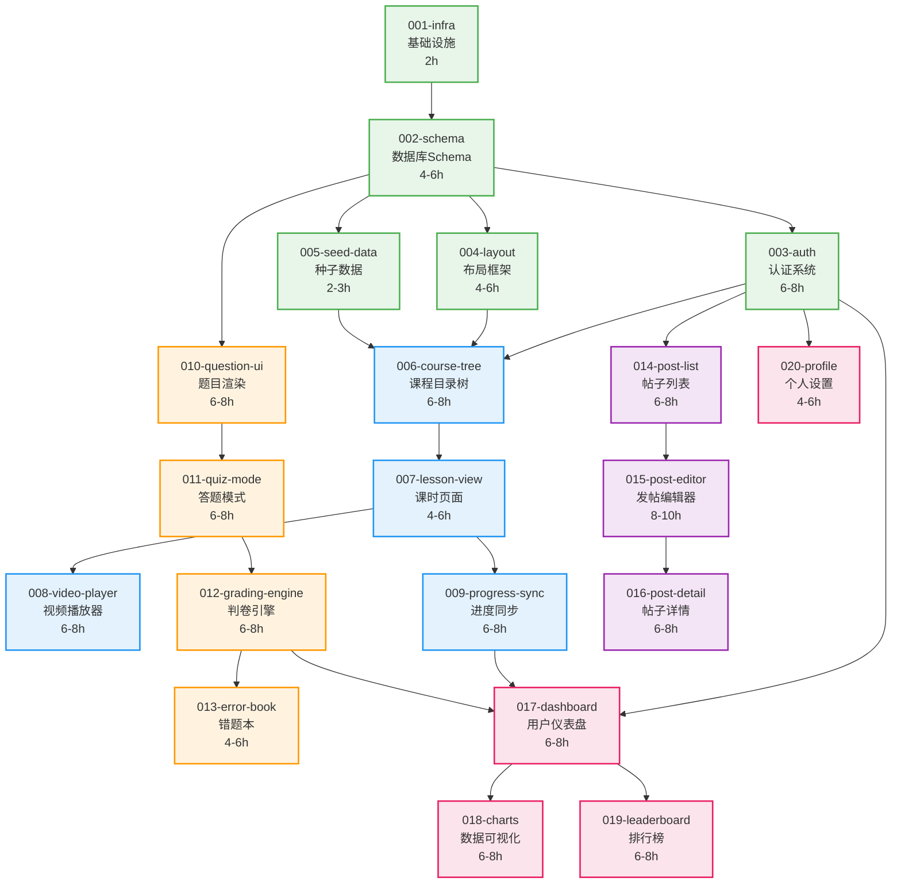

# 开发故事总览 (Stories Overview)

**项目名称**: 中学生在线教育平台 (LearnMore)
**方法论**: BMAD-METHOD
**总故事数**: 20
**预估总工时**: 120-160 Hours

---

## 📊 项目进度概览

| 阶段 | 故事数 | 预估工时 | 完成度 |
|------|--------|----------|--------|
| **Phase 1: Foundation** | 4 | 12-16h | 0% |
| **Phase 2: Course Engine** | 5 | 28-36h | 0% |
| **Phase 3: Question Bank** | 4 | 24-32h | 0% |
| **Phase 4: Community** | 3 | 20-26h | 0% |
| **Phase 5: Growth & Stats** | 4 | 24-32h | 0% |

**当前状态**: 所有故事在 `backlog/` 待办状态

---

## 🗺️ 故事依赖关系图



---

## 🔄 并行开发建议

### Sprint 1 (Week 1): Foundation
**串行执行** (需要顺序完成):
- 001-infra → 002-schema

**预估**: 6-8 hours

---

### Sprint 2 (Week 1-2): Auth & Layout
**可并行执行**:
- 003-auth (1人, 6-8h)
- 004-layout (1人, 4-6h)
- 005-seed-data (半天, 2-3h)

**前置条件**: 002完成
**预估**: 12-17 hours (单人顺序执行) 或 8 hours (2人并行)

---

### Sprint 3 (Week 2): Course Foundation
**串行执行**:
- 006-course-tree (依赖003+004+005全部完成)

**预估**: 6-8 hours

---

### Sprint 4 (Week 3): Course Features
**可并行执行**:
- 008-video-player (1人)
- 009-progress-sync (1人)

**前置条件**: 007完成
**预估**: 12-16 hours (单人) 或 8 hours (2人)

---

### Sprint 5 (Week 3-4): Question Bank
**串行执行** (业务逻辑紧密耦合):
- 010-question-ui → 011-quiz-mode → 012-grading-engine → 013-error-book

**预估**: 22-30 hours

---

### Sprint 6 (Week 4-5): Community
**串行执行** (功能递进):
- 014-post-list → 015-post-editor → 016-post-detail

**预估**: 20-26 hours

---

### Sprint 7 (Week 5-6): Growth System
**串行 + 并行混合**:
- 017-dashboard (必须先完成)
- 然后并行: 018-charts + 019-leaderboard
- 独立: 020-profile (可随时插入)

**预估**: 22-30 hours

---

## 📝 故事状态说明

### 文件夹结构
```
docs/stories/
├── README.md              # 本文档
├── RETROSPECTIVE.md       # 回顾会议记录
├── backlog/               # 待办故事
├── active/                # 进行中故事 (最多3个)
└── completed/             # 已完成故事
```

### 状态转换规则
```
backlog/ → active/ → completed/
```

**移动到 active/ 的条件**:
- 所有前置依赖已完成
- 开发者已分配
- 预估时间已确认

**移动到 completed/ 的条件**:
- 所有 Objectives 完成
- 所有 Verification 测试通过
- Definition of Done 清单完成
- Code Review 已通过

---

## 🎯 各阶段里程碑

### Milestone 1: MVP Foundation (Week 1-2)
**目标**: 项目能跑起来,能注册登录
**包含故事**: 001-005
**验收标准**:
- ✅ 能访问首页
- ✅ 能注册新用户
- ✅ 能登录并跳转Dashboard
- ✅ 数据库有基础数据

---

### Milestone 2: Core Learning Loop (Week 2-3)
**目标**: 学生能浏览课程、观看视频
**包含故事**: 006-009
**验收标准**:
- ✅ 课程目录树完整展示
- ✅ 视频能正常播放
- ✅ 学习进度能记录

---

### Milestone 3: Question Bank Ready (Week 3-4)
**目标**: 学生能刷题、查看错题
**包含故事**: 010-013
**验收标准**:
- ✅ 题目渲染正确 (公式显示正常)
- ✅ 能完整做一套题并获得分数
- ✅ 错题自动加入错题本

---

### Milestone 4: Community Beta (Week 4-5)
**目标**: 学生能发帖、评论
**包含故事**: 014-016
**验收标准**:
- ✅ 能发布包含图片的帖子
- ✅ 能回复和点赞
- ✅ 没有XSS漏洞

---

### Milestone 5: V1.0 Launch (Week 5-6)
**目标**: 完整产品,可以正式上线
**包含故事**: 017-020
**验收标准**:
- ✅ Dashboard 数据准确
- ✅ 排行榜实时更新
- ✅ 性能指标达标 (API P95 < 500ms)

---

## 🔍 关键路径分析

**关键路径 (Critical Path)**: 决定项目最短完成时间的路径

```
001 → 002 → 003 → 006 → 007 → 009 → 017 → 018
```

**关键路径总工时**: 44-60 hours
**理论最短完成时间**: 6-8 工作日 (按每天8小时计算)
**实际预估**: 考虑调试和返工,建议预留 **10-12 工作日**

---

## 📊 工作量统计

### 按类型分类
| 类型 | 故事数 | 工时 |
|------|--------|------|
| 基础设施 | 2 | 6-8h |
| UI组件 | 6 | 32-44h |
| 业务逻辑 | 8 | 52-72h |
| 集成功能 | 4 | 24-32h |

### 按难度分类
| 难度 | Story Points | 故事数 | 示例 |
|------|-------------|--------|------|
| 简单 (2分) | 2 | 3 | 001, 005, 020 |
| 中等 (5分) | 5 | 12 | 004, 006, 010, 014... |
| 困难 (8分) | 8 | 5 | 003, 008, 012, 015, 019 |

**总Story Points**: 90 分

---

## 🚨 风险识别

### 高风险故事 (需要特别关注)

1. **002-schema** (高风险)
   - **风险**: 数据库设计错误会影响所有后续开发
   - **缓解**: 在执行前,请2-3人Review Schema设计

2. **003-auth** (高风险)
   - **风险**: Supabase Auth同步失败,用户无法登录
   - **缓解**: 先在Dev环境充分测试Trigger逻辑

3. **012-grading-engine** (中高风险)
   - **风险**: 判卷逻辑复杂,容易出现边缘情况bug
   - **缓解**: 编写完整的单元测试 (覆盖率>90%)

4. **019-leaderboard** (中风险)
   - **风险**: 高并发下性能可能不足
   - **缓解**: 提前做压力测试,准备降级方案

---

## 📚 相关文档

- [PRD.md](../PRD.md) - 产品需求文档
- [TECH_STACK.md](../TECH_STACK.md) - 技术架构文档
- [Story模板](./story_template.md) - 标准故事格式

---

## 📞 协作约定

### Daily Standup (每日站会)
**时间**: 每天上午10:00
**时长**: 15分钟
**内容**:
- 昨天完成了什么 Story?
- 今天计划做什么?
- 有什么阻塞问题?

### Story Kickoff (故事启动会)
**触发**: 将Story从 backlog/ 移到 active/ 时
**参与者**: 负责该Story的开发者 + Tech Lead
**内容**:
- 确认技术方案
- 识别潜在风险
- 明确验收标准

### Code Review (代码审查)
**时机**: Story完成,提交PR后
**标准**: 至少1人Approve
**检查清单**:
- [ ] 代码符合ESLint规范
- [ ] 关键逻辑有注释
- [ ] 测试覆盖核心功能
- [ ] 没有硬编码的敏感信息

---

**最后更新**: 2025-12-09
**维护者**: @your-name
